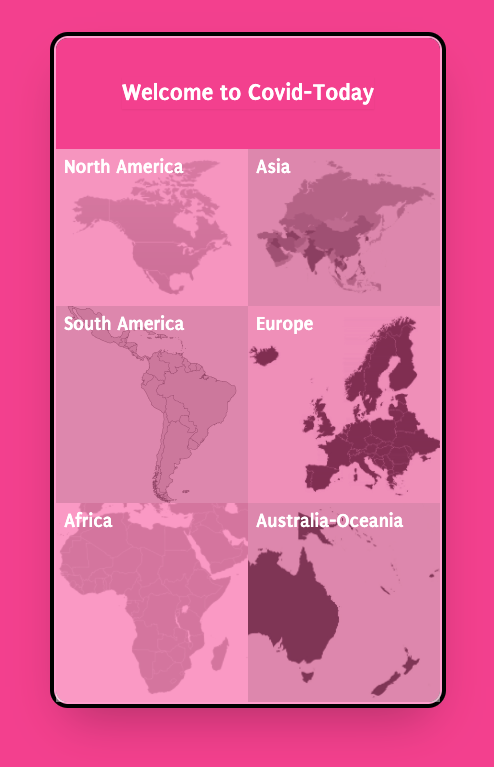
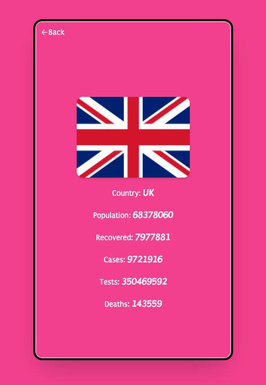

# Covid-Today
Covid-Today is a React application that receives daily covid statistics from all countries, and you can check to see the latest data.

Homepage View                                  |  Single Country View                              |
:------------------------------------------------:|:-----------------------------------------------:
                 |               | 

## Online versions
- [Netlify]()

## Breif descrption video
- [Video]()

## Built With

- React / Redux

## How to run the program locally
- Clone the project: ```https://github.com/SamanAtashi/COVID_19-Metrics.git```
- Skip if you already have node installed otherwise download [nodejs](https://nodejs.org/en/download/) install it on your system
- Install the node modules: ```npm install```
- Run the app: ```npm start``` or ```yarn start```

## How to run the test
- Clone the project: ```https://github.com/SamanAtashi/COVID_19-Metrics.git```
- Skip if you already have node installed otherwise download [nodejs](https://nodejs.org/en/download/) install it on your system
- Install the node modules: ```npm install```
- Run the app: ```npm test``` or ```yarn test```

## Author

👤 **Saman Atashi**

- Twitter: [@AtashiSaman](https://twitter.com/AtashiSaman)
- GitHub: [@SamanAtashi](https://github.com/SamanAtashi)
- LinkedIn: [@saman-atashi](https://www.linkedin.com/in/saman-atashi/)


## 🤝 Contributing

Contributions, issues, and feature requests are welcome!

Feel free to check the [issues page](../../issues/).

## Show your support

Give a ⭐️ if you like this project!

## Acknowledgments
- microverseinc for the readme template
- [Creative Common License of design](https://creativecommons.org/licenses/by-nc/4.0/)
- Original Design by [Nelson Sakwa on Behance](https://www.behance.net/sakwadesignstudio)
- [Teleport Api](https://teleport.org/)